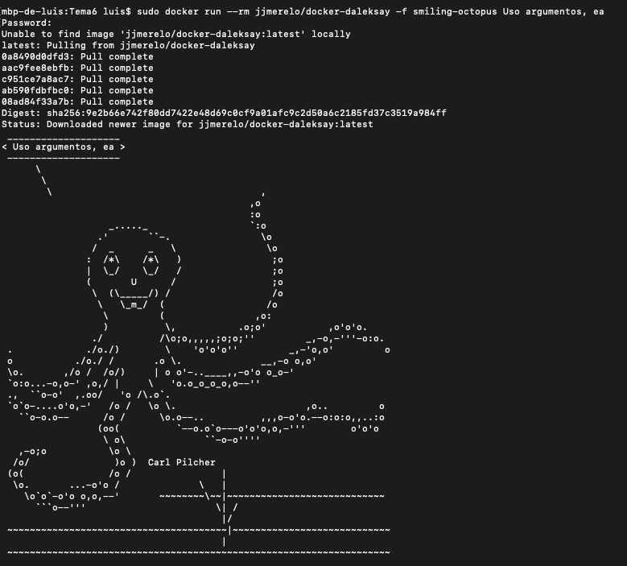
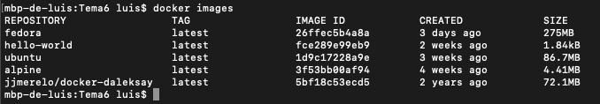
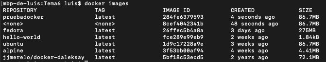

# Contenedores

## Docker

Como es ya tradición el primer paso es descargar el instalador para Mac OS. Podemos hacerlo [aquí](https://hub.docker.com/editions/community/docker-ce-desktop-mac).

Una vez que lo hemos instalado y nos hemos logueado la aplicación nos indicará que se ha completdo, podemos comprobar desde terminal que todo está OK con el siguiente comando:
~~~
docker version
docker run hello-world
~~~

Comandos interesantes:

- Listar las imágenes que tengo:
    ~~~
    docker images
    ~~~
- Listar los contenedores:
    ~~~
    docker ps -a
    ~~~
- Borrar el contenedor una vez ejecutada la imagen:
    ~~~
    docker run --rm nombreImagen
    ~~~
- Pasar parámetros en la instrucción:
    ~~~
    sudo docker run --rm nombreImagen -f parametros
    ~~~
- Descargar imagen:
    ~~~
    docker pull nombreImagen
    ~~~
- Ejecutar comando en imagen:
    ~~~
    docker run --rm nombreImagen nombreComando
    ~~~
- Entrar en una imagen para ejecutar comando dentro:
    ~~~
    docker run -it nombreImagen sh
    ~~~
- 
    ~~~
    
    ~~~
- 
    ~~~
    
    ~~~

## Ejercicios

### Ejercicio 4 - Buscar alguna demo interesante de Docker y ejecutarla localmente, o en su defecto, ejecutar la imagen anterior y ver cómo funciona y los procesos que se llevan a cabo la primera vez que se ejecuta y las siguientes ocasiones.

Vamos a probar con el ejemplo que se nos proporciona:
~~~
sudo  sudo docker run --rm jjmerelo/docker-daleksay -f smiling-octopus Uso argumentos, ea 
~~~

Una vez que hemos visto como se instala y se ejecuta, vamos a probar una segunda vez con otro texto:
~~~
sudo  sudo docker run --rm jjmerelo/docker-daleksay -f smiling-octopus Realizo ejercicio 4 
~~~

### Ejercicio 5 -Comparar el tamaño de las imágenes de diferentes sistemas operativos base, Fedora, CentOS y Alpine, por ejemplo.

Se ha instalado fedora, ubuntu y alpine, siendo la primera la que más espacio ocupa:

### Ejercicio 6 - Crear a partir del contenedor anterior una imagen persistente con commit.

Pasos que se han realizado:

- Se ha creado un interprete de ordenes sobre la imagen de ubuntu:
    ~~~
    docker run -it ubuntu /bin/bash
    ~~~
- Una vez que hacemos exit, usamos *docker ps -l* para ver el ID, tambien podemos hacer *docker inspect ubuntu* y asi ver la info al completo. Una vez que sabemos el ID hacemos:
    ~~~
    docker commit ID nombreImagenNueva
    ~~~
- Esto nos poduce un sha256 como salida. Entonces ahora si queremos comprobar que se ha creado la imagen hacemos: 
    ~~~
    docker images
    ~~~

Luego se ha intentado realizar un push hasta el repositorio, aunque con éxito, no tengo claro que haya sido correctamente. Para ello, una vez logueados correctamente en la página de docker:
~~~
docker tag pruebadocker:latest luiisgallego/pruebadocker
docker push luiisgallego/pruebadocker
~~~

### Ejercicio 8 - Crear un volumen y usarlo, por ejemplo, para escribir la salida de un programa determinado.

Se ha seguido principalmente el ejemplo de la documentacion:

- Primero creamos el volumen, hacemos pull a fedora y accedemos a la imagen:
    ~~~
    docker volume create benchmark
    docker pull fedora
    docker run -it --rm -v benchmark:/app fedora /bin/bash
    ~~~
- Una vez dentro, nos dirigimos a la carpeta app, instalamos nano y creamos el script del ejemplo (ls -R / | wc):
    ~~~
    cd app
    yum install nano
    nano bm.sh 
    chmod 777 bm.sh
    ./bm.sh
    exit
    ~~~
- Ya podemos probarlo con cualquier imagen:
    ~~~
    docker run -it --rm -v benchmark:/app fedora sh /app/bm.sh
    docker run -it --rm -v benchmark:/app alpine sh /app/bm.sh
    ~~~

